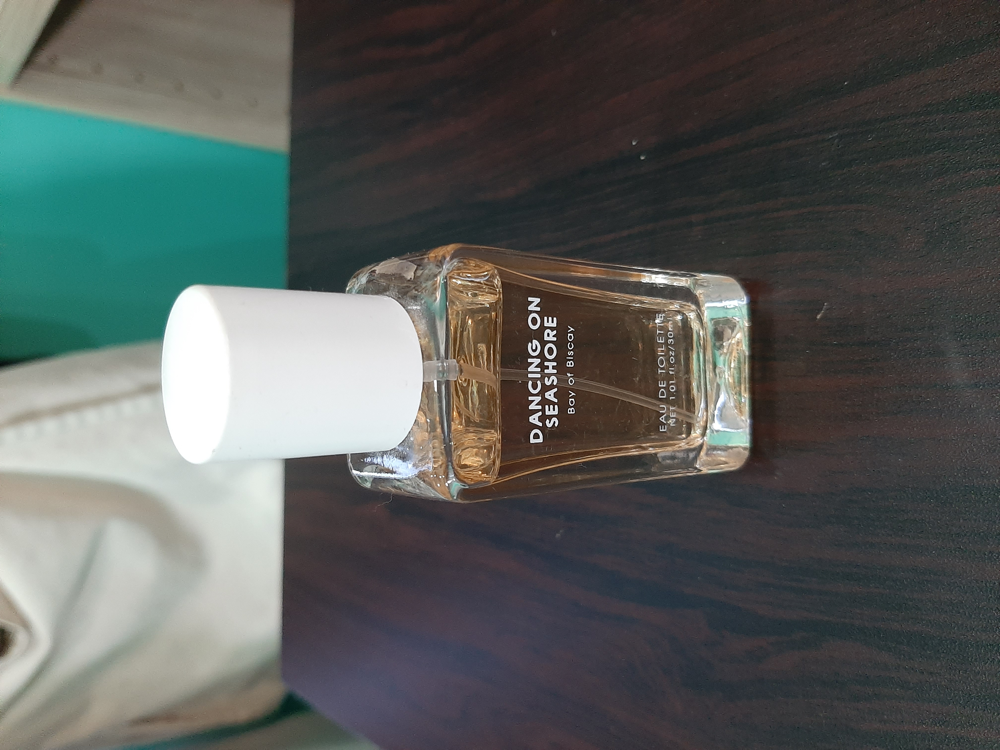
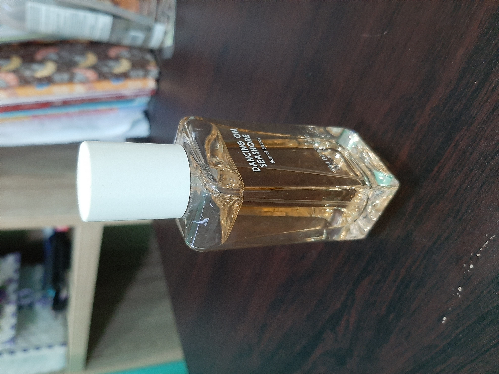
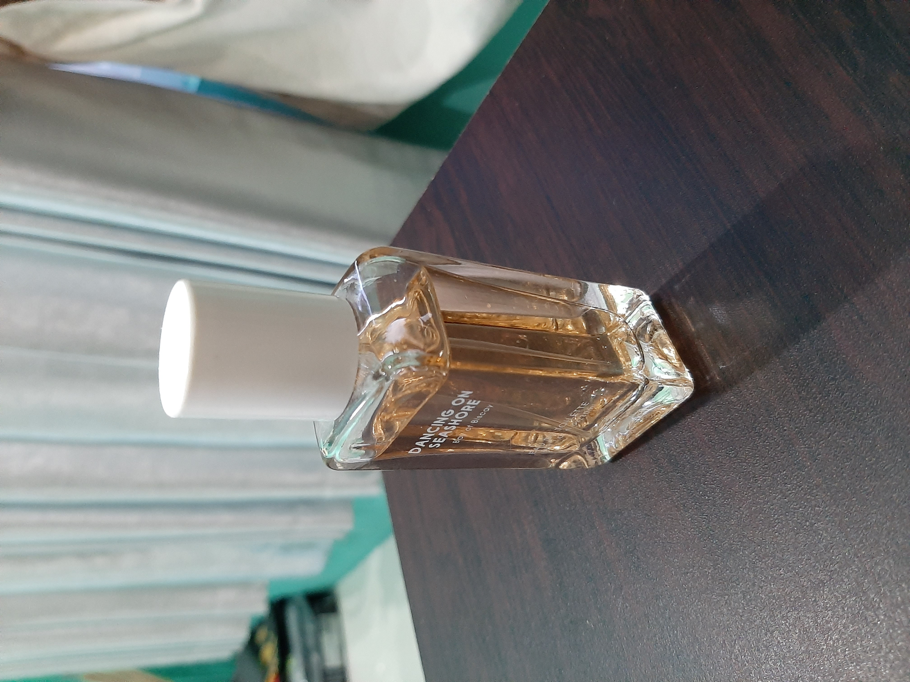
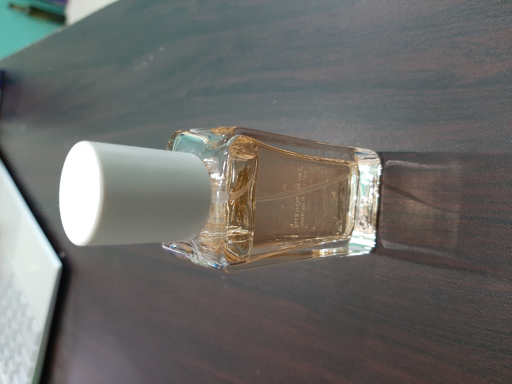

# tugas-1-vwxyraz

Vyra Fania Adelina
05111940000109

## Tugas 1
1. Cari benda di sekitar Anda yang berawalan huruf B, G, atau L.
2. Letakkan benda tersebut di atas permukaan datar: meja, lantai, dsb.
3. Ambil foto benda tersebut dari empat sudut pandang yang berbeda: kanan atas, kiri atas, belakang atas, depan atas (sudut kemiringan bebas).

## Benda
Pada tugas ini saya memilih botol parfum

### Depan Atas

### Kanan Atas

### Kiri Atas

### Belakang Atas

